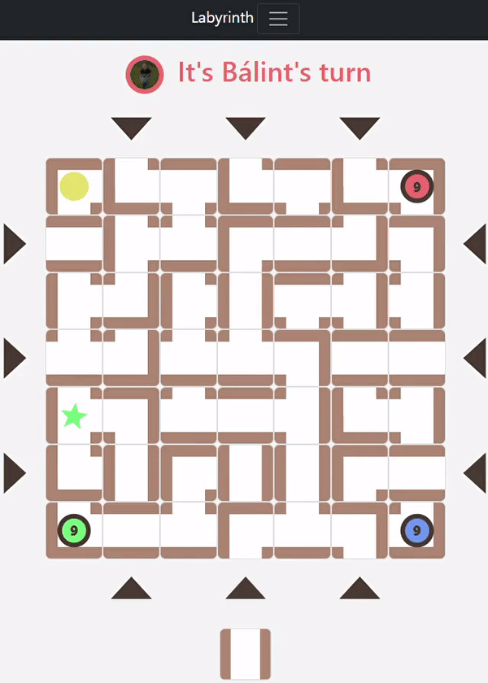

# Labyrinth - Express - Node.js
Labirintus társasjátékot valósítom meg mind szerver és mind kliens oldalon:  
https://labyrinth-board-game.jonatnpallag.repl.co/

    

## Szabály
A társasjáték szabályához nyisd meg a következő weboldalt:
url http://elfnet.hu/kikapcsolodas/tarsasjatekok/labyrinth.php

A szabályt teljes mértékben megörzöm, azon egyszerűsítéstől eltekintve, hogy a cél az adott személy számára mindig be 
lesz jelölve és nem kell szimbólum alapján megkeresni

## Weboldal
### /
Főoldal, itt van lehetőség a bejelentkezéshez, akár a `Google`-on keresztül is

### /register
Új felhasználó regisztrálására ad lehetőséget (hagyományos, nem `Google`-on keresztül)

### /forgotpassword
Amennyiben elfelejted a jelszavad itt az adott emailcímre kaphatsz új jelszót,
amit rövid időn belül érdemes megváltoztatni.

### /home
>Üres oldal (házi feladaton kívül szeretném majd itt megjeleníteni a különböző emberhez tartozó statisztikákat)

### /friends
>Üres oldal (házi feladaton kívül szeretnék majd foglalkozni vele)

### /gameteams
Lehetőség van a `email` címek alapján csapatokat létrehozni, ahol indíthatunk játékot. Egy csapatban max négy ember lehet, és minimum 2, ez szerkeszthető, törölhető.

A honlapon megjelennek az egyeses csapatok, amelyeknek részesei vagyunk. A kis kártyákon amennyiben a bal felső fogaskerékre kattintunk,
akkor tudjuk módosítani a csapatot (név, leírás, csapatban szereplő `email`címek színekhez rendelve).

A kártyák jobb felső sarkában szerepel, hogy hány játék volt, továbbá középen az egyes profilképek mellett megjelenik, hogy hány győzelmet ért el egy adott játékos.

Az új csapat létrehozása gom segítségével tudunk újat létrehozni.

### /profileSettings
Lehetőség van a profilunkhoz tartozó adatok módosítására (`email`, `name`, ...), vagy akár `profilkép`-et is felötlhetünk itt!

